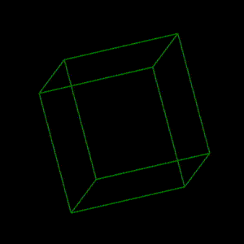

# Canvas Cube

It's a demo project to draw a rotating cube animation over canvas.

## References:
*  [Rotation matrix](https://en.wikipedia.org/wiki/Rotation_matrix)
* [Tutorial 10 - Introduction to Matrix Math in OpenGL](https://www.youtube.com/watch?v=V6sJpjYzfaQ&ab_channel=JeffreyChastine)
* [OpenGL Ogrenin - Donusumler (TR)](https://cgtranslators.gitbook.io/opengl-ogrenin/baslarken/doenuesuemler)
* [StackOverflow post - matrix multiplication algorithm](https://stackoverflow.com/questions/27205018/multiply-2-matrices-in-javascript)